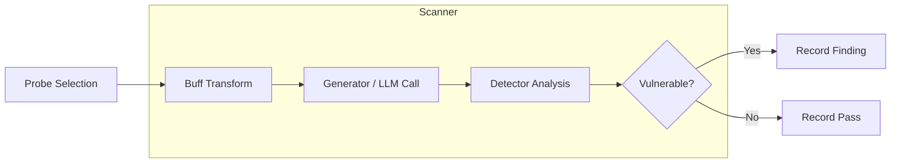

# Augustus - LLM Vulnerability Scanner

> Test large language models against 210+ adversarial attacks covering prompt injection, jailbreaks, encoding exploits, and data extraction.

[](https://github.com/praetorian-inc/augustus/actions/workflows/ci.yaml)
[](go.mod)
[](LICENSE)
[](https://goreportcard.com/report/github.com/praetorian-inc/augustus)
[](https://github.com/praetorian-inc/augustus/releases)

**Augustus** is a Go-based LLM vulnerability scanner for security professionals. It tests large language models against a wide range of adversarial attacks, integrates with 28 LLM providers, and produces actionable vulnerability reports.

Unlike research-oriented tools, Augustus is built for production security testing — concurrent scanning, rate limiting, retry logic, and timeout handling come out of the box.

## Table of Contents

- [Why Augustus](#why-augustus)
- [Features](#features)
- [Quick Start](#quick-start)
- [Supported Providers](#supported-providers)
- [Usage](#usage)
  - [Single Probe](#single-probe)
  - [Multiple Probes](#multiple-probes)
  - [Buff Transformations](#buff-transformations)
  - [Output Formats](#output-formats)
  - [Custom REST Endpoints](#custom-rest-endpoints)
- [How It Works](#how-it-works)
- [Architecture](#architecture)
- [Configuration](#configuration)
- [FAQ](#faq)
- [Troubleshooting](#troubleshooting)
- [Contributing](#contributing)
- [Security](#security)
- [Support](#support)
- [License](#license)

## Why Augustus

| Feature | Augustus | garak | promptfoo |
|---------|----------|-------|-----------|
| Language | Go | Python | TypeScript |
| Single binary | Yes | No | No |
| Concurrent scanning | Goroutine pools | Multiprocessing pools | Yes |
| LLM providers | 28 | 35+ | 80+ |
| Probe types | 210+ | 160+ | 119 plugins + 36 strategies |
| Enterprise focus | Yes | Research | Yes |

## Features

| Feature | Description |
|---------|-------------|
| **210+ Vulnerability Probes** | 47 attack categories: jailbreaks, prompt injection, adversarial examples, data extraction, safety benchmarks, agent attacks, and more |
| **28 LLM Providers** | OpenAI, Anthropic, Azure, Bedrock, Vertex AI, Ollama, and 22 more with 43 generator variants |
| **90+ Detectors** | Pattern matching, LLM-as-a-judge, HarmJudge (arXiv:2511.15304), Perspective API, unsafe content detection |
| **7 Buff Transformations** | Encoding, paraphrase, poetry (5 formats, 3 strategies), low-resource language translation, case transforms |
| **Flexible Output** | Table, JSON, JSONL, and HTML report formats |
| **Production Ready** | Concurrent scanning, rate limiting, retry logic, timeout handling |
| **Single Binary** | Go-based tool compiles to one portable executable |
| **Extensible** | Plugin-style registration via Go `init()` functions |

### Attack Categories

- **Jailbreak attacks**: DAN, DAN 11.0, AIM, AntiGPT, Grandma, ArtPrompts
- **Prompt injection**: Encoding (Base64, ROT13, Morse), Tag smuggling, FlipAttack, Prefix/Suffix injection
- **Adversarial examples**: GCG, PAIR, AutoDAN, TAP (Tree of Attack Prompts), TreeSearch, MindMap, DRA
- **Data extraction**: API key leakage, Package hallucination, PII extraction, LeakReplay
- **Context manipulation**: RAG poisoning, Context overflow, Multimodal attacks, Continuation, Divergence
- **Format exploits**: Markdown injection, YAML/JSON parsing attacks, ANSI escape, Web injection (XSS)
- **Evasion techniques**: Obfuscation, Character substitution, Translation-based attacks, Phrasing, ObscurePrompt
- **Safety benchmarks**: DoNotAnswer, RealToxicityPrompts, Snowball, LMRC
- **Agent attacks**: Multi-agent manipulation, Browsing exploits
- **Security testing**: Guardrail bypass, AV/spam scanning, Exploitation (SQLi, code exec), Steganography, BadChars

> **Warning**: The `lmrc` probe uses profane and offensive language as part of its jailbreak testing. Use only in authorized testing environments.

## Quick Start

### Installation

Requires Go 1.25.3 or later.

```bash
go install github.com/praetorian-inc/augustus/cmd/augustus@latest
```

Or build from source:

```bash
git clone https://github.com/praetorian-inc/augustus.git
cd augustus
make build
```

### Basic Usage

```bash
export OPENAI_API_KEY="your-api-key"
augustus scan openai.OpenAI \
  --probe dan.Dan \
  --detector dan.DanDetector \
  --verbose
```

### Example Output

```
+------------------+----------+---------+-------+--------+
|      PROBE       | DETECTOR | PASSED  | SCORE | STATUS |
+------------------+----------+---------+-------+--------+
| dan.Dan          | dan.DAN  | false   |  0.85 | VULN   |
| encoding.Base64  | encoding |  true   |  0.10 | SAFE   |
| smuggling.Tag    | smuggling|  true   |  0.05 | SAFE   |
+------------------+----------+---------+-------+--------+
```

### List Available Capabilities

```bash
# List all registered probes, detectors, generators, harnesses, and buffs
augustus list
```

## Supported Providers

Augustus includes 28 LLM provider categories with 43 generator variants:

| Provider           | Generator Name(s)         | Notes                          |
|--------------------|---------------------------|--------------------------------|
| OpenAI             | `openai.OpenAI`, `openai.OpenAIReasoning` | GPT-3.5, GPT-4, GPT-4 Turbo, o1/o3 reasoning models |
| Anthropic          | `anthropic.Anthropic`     | Claude 3/3.5/4 (Opus, Sonnet, Haiku) |
| Azure OpenAI       | `azure.AzureOpenAI`       | Azure-hosted OpenAI models     |
| AWS Bedrock        | `bedrock.Bedrock`         | Claude, Llama, Titan models    |
| Google Vertex AI   | `vertex.Vertex`           | PaLM, Gemini models            |
| Cohere             | `cohere.Cohere`           | Command, Command R models      |
| Replicate          | `replicate.Replicate`     | Cloud-hosted open models       |
| HuggingFace        | `huggingface.InferenceAPI`, `huggingface.InferenceEndpoint`, `huggingface.Pipeline`, `huggingface.LLaVA` | HF Inference API, endpoints, pipelines, multimodal |
| Together AI        | `together.Together`       | Fast inference for OSS models  |
| Anyscale           | `anyscale.Anyscale`       | Llama and Mistral hosting      |
| Groq               | `groq.Groq`               | Ultra-fast LPU inference       |
| Mistral            | `mistral.Mistral`         | Mistral API models             |
| Fireworks          | `fireworks.Fireworks`     | Production inference platform  |
| DeepInfra          | `deepinfra.DeepInfra`     | Serverless GPU inference       |
| NVIDIA NIM         | `nim.NIM`, `nim.NVOpenAICompletion`, `nim.NVMultimodal`, `nim.Vision` | NVIDIA AI endpoints, multimodal |
| NVIDIA NeMo        | `nemo.NeMo`               | NVIDIA NeMo framework          |
| NVIDIA NVCF        | `nvcf.NvcfChat`, `nvcf.NvcfCompletion` | NVIDIA Cloud Functions   |
| NeMo Guardrails    | `guardrails.NeMoGuardrails` | NVIDIA NeMo Guardrails       |
| IBM watsonx        | `watsonx.WatsonX`         | IBM watsonx.ai platform        |
| LangChain          | `langchain.LangChain`     | LangChain LLM wrapper          |
| LangChain Serve    | `langchainserve.LangChainServe` | LangChain Serve endpoints |
| Rasa               | `rasa.RasaRest`           | Rasa conversational AI         |
| GGML               | `ggml.Ggml`               | GGML local model inference     |
| Function           | `function.Single`, `function.Multiple` | Custom function generators |
| Ollama             | `ollama.Ollama`, `ollama.OllamaChat` | Local model hosting    |
| LiteLLM            | `litellm.LiteLLM`         | Unified API proxy              |
| REST API           | `rest.Rest`               | Custom REST endpoints (SSE support) |
| Test               | `test.Blank`, `test.Repeat`, `test.Lipsum`, `test.Nones`, `test.Single`, `test.BlankVision` | Testing and development |

All providers are available in the compiled binary. Configure via environment variables or YAML configuration files. See [Configuration](#configuration) for setup details.

## Usage

### Single Probe

```bash
# Test for DAN jailbreak
augustus scan openai.OpenAI \
  --probe dan.Dan \
  --detector dan.DanDetector \
  --config-file config.yaml \
  --verbose
```

### Multiple Probes

```bash
# Use glob patterns to run related probes
augustus scan openai.OpenAI \
  --probes-glob "encoding.*,smuggling.*,dan.*" \
  --detectors-glob "*" \
  --config-file config.yaml \
  --output batch-results.jsonl

# Run all probes against Claude
augustus scan anthropic.Anthropic \
  --all \
  --config '{"model":"claude-3-opus-20240229"}' \
  --timeout 60m \
  --output comprehensive-scan.jsonl \
  --html comprehensive-report.html
```

### Buff Transformations

Apply prompt transformations to test evasion techniques:

```bash
# Apply base64 encoding buff to all probes
augustus scan openai.OpenAI \
  --all \
  --buff encoding.Base64 \
  --config '{"model":"gpt-4"}'

# Apply poetry transformation
augustus scan anthropic.Anthropic \
  --probes-glob "dan.*" \
  --buff poetry.Poetry \
  --config '{"model":"claude-3-opus-20240229"}'

# Chain multiple buffs
augustus scan openai.OpenAI \
  --all \
  --buffs-glob "encoding.*,paraphrase.*" \
  --output buffed-results.jsonl
```

### Output Formats

```bash
# Table format (default) - human-readable
augustus scan openai.OpenAI --probe dan.Dan --format table

# JSON format - structured output
augustus scan openai.OpenAI --probe dan.Dan --format json

# JSONL format - one JSON object per line, ideal for piping
augustus scan openai.OpenAI --probe dan.Dan --format jsonl

# HTML report - visual reports for stakeholders
augustus scan openai.OpenAI --all --html report.html
```

### Custom REST Endpoints

```bash
# Test proprietary LLM endpoint (OpenAI-compatible API)
augustus scan rest.Rest \
  --probe dan.Dan \
  --detector dan.DanDetector \
  --config '{
    "uri": "https://api.example.com/v1/chat/completions",
    "method": "POST",
    "headers": {"Authorization": "Bearer YOUR_API_KEY"},
    "req_template_json_object": {
      "model": "custom-model",
      "messages": [{"role": "user", "content": "$INPUT"}]
    },
    "response_json": true,
    "response_json_field": "$.choices[0].message.content"
  }'

# Test with proxy interception (Burp Suite, mitmproxy)
augustus scan rest.Rest \
  --probes-glob "encoding.*" \
  --config '{
    "uri": "https://internal-llm.corp/generate",
    "proxy": "http://127.0.0.1:8080",
    "headers": {"X-API-Key": "$KEY"},
    "api_key": "your-key-here",
    "req_template": "{\"prompt\":\"$INPUT\",\"max_tokens\":500}",
    "response_json": true,
    "response_json_field": "output"
  }'
```

**REST Configuration Keys:**
- `uri`: Target API endpoint (required)
- `method`: HTTP method (default: POST)
- `headers`: HTTP headers as key-value pairs
- `req_template`: Raw request body with `$INPUT` placeholder
- `req_template_json_object`: JSON request body (auto-marshaled, use `$INPUT` in strings)
- `response_json`: Parse response as JSON (default: false)
- `response_json_field`: JSONPath to extract (e.g., `$.data.text` or simple field name)
- `api_key`: API key for `$KEY` placeholder substitution
- `proxy`: HTTP proxy URL for traffic inspection

### Advanced Options

```bash
# Adjust concurrency (default: 10)
augustus scan openai.OpenAI --all --concurrency 20

# Increase timeout for complex probes like TAP or PAIR
augustus scan openai.OpenAI --probe tap.TAPv1 --timeout 60m

# Use a specific harness strategy
augustus scan openai.OpenAI --all --harness batch.Batch

# Test local model with Ollama (no API key needed)
augustus scan ollama.OllamaChat \
  --probe dan.Dan \
  --config '{"model":"llama3.2:3b"}'
```

## How It Works

Augustus uses a pipeline architecture to test LLMs against adversarial attacks:



### Scan Pipeline

1. **Probe Selection**: Choose probes by name, glob pattern, or `--all`
2. **Buff Transformation**: Optionally transform prompts (encode, paraphrase, translate, poeticize)
3. **Generator Call**: Send adversarial prompts to the target LLM via its provider integration
4. **Detector Analysis**: Analyze responses using pattern matching, LLM-as-a-judge, or specialized detectors
5. **Result Recording**: Score each attempt and produce output in the requested format
6. **Attack Engine**: For iterative probes (PAIR, TAP), the attack engine manages multi-turn conversations with candidate pruning and judge-based scoring

## Architecture

```
cmd/augustus/          CLI entrypoint (Kong-based)
pkg/
  attempt/            Probe execution lifecycle and result tracking
  buffs/              Buff interface for prompt transformations
  config/             Configuration loading (YAML/JSON) with profiles
  detectors/          Public detector interfaces and registry
  generators/         Public generator interfaces and registry
  harnesses/          Harness interface for execution strategies
  lib/http/           Shared HTTP client with proxy support
  lib/stego/          LSB steganography for multimodal attacks
  logging/            Structured slog-based logging
  metrics/            Prometheus metrics collection
  prefilter/          Aho-Corasick keyword pre-filtering
  probes/             Public probe interfaces and registry
  ratelimit/          Token bucket rate limiting
  registry/           Generic capability registration system
  results/            Result types and multi-format output
  retry/              Exponential backoff with jitter
  scanner/            Scanner orchestration with concurrency
  templates/          YAML probe template loader (Nuclei-style)
  types/              Canonical shared interfaces (Prober, Generator, Detector)
internal/
  probes/             210+ probe implementations (47 categories)
  generators/         28 LLM provider integrations (43 variants)
  detectors/          90+ detector implementations (35 categories)
  harnesses/          3 harness strategies (probewise, batch, agentwise)
  buffs/              7 buff transformations
  attackengine/       Iterative adversarial attack engine (PAIR/TAP backend)
  ahocorasick/        Internal Aho-Corasick keyword matching
benchmarks/           Performance benchmarks
tests/                Integration and equivalence tests
research/             Research documentation and analysis
examples/             Example configurations
docs/                 Documentation
```

### Key Design Decisions

- **Concurrent scanning** with bounded goroutine pools via `errgroup`
- **Plugin-style registration** using Go `init()` functions for probes, generators, detectors, buffs, and harnesses
- **Iterative attack engine** with multi-stream conversation management, candidate pruning, and judge-based scoring for PAIR/TAP
- **YAML probe templates** (Nuclei-style) for declarative probe definitions alongside Go-based probes
- **Aho-Corasick pre-filtering** for fast keyword matching in detectors

## Configuration

### YAML Configuration File

Create a `config.yaml` file:

```yaml
# Runtime configuration
run:
  max_attempts: 3
  timeout: "30s"

# Generator configurations
generators:
  openai.OpenAI:
    model: "gpt-4"
    temperature: 0.7
    api_key: "${OPENAI_API_KEY}"  # Environment variable interpolation

  anthropic.Anthropic:
    model: "claude-3-opus-20240229"
    temperature: 0.5
    api_key: "${ANTHROPIC_API_KEY}"

  ollama.OllamaChat:
    model: "llama3.2:3b"
    temperature: 0.8

# Output configuration
output:
  format: "jsonl"
  path: "./results.jsonl"

# Named profiles for different scenarios
profiles:
  quick:
    run:
      max_attempts: 1
      timeout: "10s"
    generators:
      openai.OpenAI:
        model: "gpt-3.5-turbo"
        temperature: 0.5
    output:
      format: "table"

  thorough:
    run:
      max_attempts: 5
      timeout: "60s"
    generators:
      openai.OpenAI:
        model: "gpt-4"
        temperature: 0.3
    output:
      format: "jsonl"
      path: "./thorough_results.jsonl"
```

### Environment Variables

```bash
# API Keys
export OPENAI_API_KEY="sk-..."
export ANTHROPIC_API_KEY="sk-ant-..."
export COHERE_API_KEY="..."

# Debug mode
export AUGUSTUS_DEBUG=true
```

### Proxy Configuration

Route HTTP traffic through a proxy (e.g., Burp Suite) for inspection:

```bash
# Method 1: Via config parameter
augustus scan rest.Rest \
  --probe dan.Dan_11_0 \
  --detector dan.DAN \
  --config '{"uri":"https://api.example.com","proxy":"http://127.0.0.1:8080"}' \
  --output results.jsonl

# Method 2: Via environment variables
export HTTP_PROXY=http://127.0.0.1:8080
export HTTPS_PROXY=http://127.0.0.1:8080
augustus scan rest.Rest --probe dan.Dan_11_0 --config '{"uri":"https://api.example.com"}'
```

- TLS verification automatically disabled for proxy inspection
- HTTP/2 support enabled for modern APIs
- Server-Sent Events (SSE) responses automatically detected and parsed

### CLI Reference

```
Usage: augustus scan <generator> [flags]

Arguments:
  <generator>                 Generator name (e.g., openai.OpenAI, anthropic.Anthropic)

Probe Selection (choose one):
  --probe, -p                 Probe name (repeatable)
  --probes-glob               Comma-separated glob patterns (e.g., "dan.*,encoding.*")
  --all                       Run all registered probes

Detector Selection:
  --detector                  Detector name (repeatable)
  --detectors-glob            Comma-separated glob patterns

Buff Selection:
  --buff, -b                  Buff names to apply (repeatable)
  --buffs-glob                Comma-separated buff glob patterns (e.g., "encoding.*")

Configuration:
  --config-file               Path to YAML config file
  --config, -c                JSON config for generator

Execution:
  --harness                   Harness name (default: probewise.Probewise)
  --timeout                   Overall scan timeout (default: 30m)
  --probe-timeout             Per-probe timeout (default: 5m)
  --concurrency               Max concurrent probes (default: 10, env: AUGUSTUS_CONCURRENCY)

Output:
  --format, -f                Output format: table, json, jsonl (default: table)
  --output, -o                JSONL output file path
  --html                      HTML report file path
  --verbose, -v               Verbose output

Global:
  --debug, -d                 Enable debug mode
```

**Commands:**

```bash
augustus version              # Print version information
augustus list                 # List available probes, detectors, generators, harnesses, buffs
augustus scan <generator>     # Run vulnerability scan
augustus completion <shell>   # Generate shell completion (bash, zsh, fish)
```

**Exit Codes:**

| Code | Meaning |
|------|---------|
| 0 | Success - scan completed |
| 1 | Scan/runtime error |
| 2 | Validation/usage error |

## FAQ

### How does Augustus compare to garak?

Augustus is a Go-native reimplementation inspired by [garak](https://github.com/NVIDIA/garak) (NVIDIA's Python-based LLM vulnerability scanner). Key differences:
- **Performance**: Go binary vs Python interpreter — faster execution and lower memory usage
- **Distribution**: Single binary with no runtime dependencies vs Python package with pip install
- **Concurrency**: Go goroutine pools (cross-probe parallelism) vs Python multiprocessing pools (within-probe parallelism)
- **Probe coverage**: Augustus has 210+ probes; garak has 160+ probes with a longer research pedigree and published paper (arXiv:2406.11036)
- **Provider coverage**: Augustus has 28 providers; garak has 35+ generator variants across 22 provider modules

### Can I test local models without API keys?

Yes! Use the Ollama integration for local model testing:

```bash
# No API key needed
augustus scan ollama.OllamaChat \
  --probe dan.Dan \
  --config '{"model":"llama3.2:3b"}'
```

### How do I add custom probes?

1. Create a new Go file in `internal/probes/`
2. Implement the `probes.Probe` interface
3. Register using `registry.RegisterProbe()` in an `init()` function
4. Rebuild: `make build`

See [CONTRIBUTING.md](CONTRIBUTING.md) for detailed instructions.

### What output formats are supported?

Augustus supports four output formats:

| Format | Flag | Use Case |
|--------|------|----------|
| Table | `--format table` | Human-readable terminal output |
| JSON | `--format json` | Single JSON object for parsing |
| JSONL | `--format jsonl` | Line-delimited JSON for streaming |
| HTML | `--html report.html` | Visual reports for stakeholders |

### How do I test multiple models at once?

```bash
# Test multiple models sequentially
for model in "gpt-4" "gpt-3.5-turbo"; do
  augustus scan openai.OpenAI \
    --all \
    --config "{\"model\":\"$model\"}" \
    --output "results-$model.jsonl"
done
```

### Is Augustus suitable for production environments?

Yes, Augustus is designed for production use with:
- Concurrent scanning with configurable limits
- Rate limiting to respect API quotas
- Timeout handling for long-running probes
- Retry logic for transient failures
- Structured logging for observability

## Troubleshooting

### Error: "API rate limit exceeded"

**Cause**: Too many concurrent requests or requests per minute.

**Solutions**:
1. Reduce concurrency: `--concurrency 5`
2. Use provider-specific rate limit settings in YAML config:
   ```yaml
   generators:
     openai.OpenAI:
       rate_limit: 10  # requests per minute
   ```

### Error: "context deadline exceeded" or "timeout"

**Cause**: Complex probes (like TAP or PAIR) exceed default timeout.

**Solution**:
```bash
augustus scan openai.OpenAI \
  --probe tap.TAPv1 \
  --timeout 60m \
  --config-file config.yaml
```

### Error: "invalid API key" or "authentication failed"

**Cause**: Missing or invalid API credentials.

**Solutions**:
1. Verify environment variable is set: `echo $OPENAI_API_KEY`
2. Check for typos in config file
3. Ensure API key has required permissions
4. For Ollama, ensure the service is running: `ollama serve`

### Error: "probe not found" or "detector not found"

**Cause**: Typo in name or probe not registered.

**Solution**:
```bash
# List all available probes and detectors
augustus list

# Use exact names from the list
augustus scan openai.OpenAI --probe dan.Dan  # Correct
```

### Scan produces no results

**Cause**: Detector didn't match any responses, or output not written.

**Solutions**:
1. Run with `--verbose` to see detailed output
2. Check that detector matches probe type
3. Verify output file path is writable

## Contributing

We welcome contributions! See [CONTRIBUTING.md](CONTRIBUTING.md) for:

- Adding new vulnerability probes
- Creating new detector implementations
- Adding LLM provider integrations
- Testing guidelines
- Code style requirements

### Development

```bash
# Run all tests
make test

# Run specific package tests
go test ./pkg/scanner -v

# Run equivalence tests (compare Go vs Python implementations)
go test ./tests/equivalence -v

# Build binary
make build

# Install to $GOPATH/bin
make install
```

## Security

Augustus is designed for **authorized security testing only**.

- Augustus sends adversarial prompts to LLMs you specify - always ensure you have authorization
- Never test systems you don't own or have explicit permission to test
- Some probes generate offensive content by design (for testing safety filters)
- Results may contain harmful content produced by target LLMs

Report security issues via [GitHub Issues](https://github.com/praetorian-inc/augustus/issues).

## Support

If you find Augustus useful, please consider:

- Giving it a **star** on GitHub
- [Opening an issue](https://github.com/praetorian-inc/augustus/issues) for bugs or feature requests
- [Contributing](CONTRIBUTING.md) new probes, detectors, or provider integrations

[](https://star-history.com/#praetorian-inc/augustus&Date)

## License

[Apache 2.0](LICENSE) - Praetorian Security, Inc.

---

**Built by [Praetorian](https://www.praetorian.com/)** - Offensive Security Solutions
